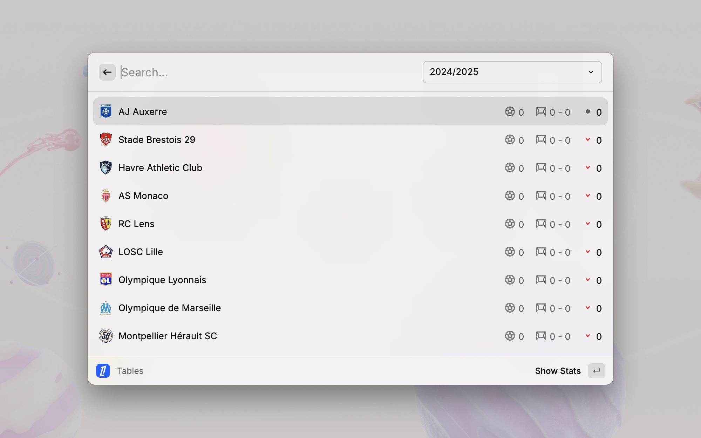

  <h1 align="center">Ligue 1</h1>

Staying up-to-date with the latest scores, and fixtures from the French top-flight football league in [Raycast](https://raycast.com/)

Access information on:

- **Tables:** View the current standings and league positions.
- **Fixtures & Results:** Check upcoming match schedules and results.
- **Clubs:** Find detailed information about individual teams, including players, coaches, and statistics.

## Issues

Report bugs or suggest improvements by creating an issue [here](https://github.com/anhthang/raycast-ligue-1/issues).
